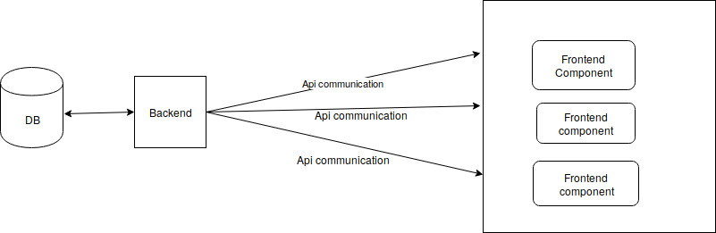

# Independent component architecture 
## Django vue blog




## Backend
- Django
- Rest API
## Backend useage
```
cd BlogBackend
python3 manage.py runserver

```

## Frontend
- Vue.js
- vue-resource
## Backend useage
```
sudo npm install
npm run dev

```